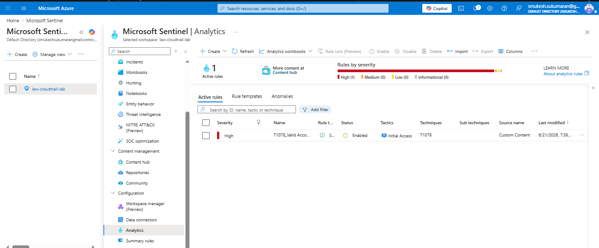

# MITRE-Mapped Cloud Threat Detection: Multi-SIEM Implementation

Detection engineering project mapping five MITRE ATT&CK cloud techniques to working detection rules across two SIEM platforms, built against simulated AWS CloudTrail telemetry.

**Author:** Mukesh Kumar — Senior Cloud Security & Operations Engineer
**Stack:** Splunk Enterprise (SPL) · Microsoft Sentinel (KQL) · Python · AWS CloudTrail schema
**Status:** Complete — all 5 detections verified executing on both platforms; one rule deployed as a live, scheduled Sentinel Analytics Rule with native MITRE ATT&CK tagging
**Repo:** [`MukeshKumarCloud/MITRE-Cloud-SIEM-Detections`](https://github.com/MukeshKumarCloud/MITRE-Cloud-SIEM-Detections)

---

## Summary

Most SIEM portfolio projects stop at "I built a dashboard." This project starts from the adversary side: five techniques from the [MITRE ATT&CK Cloud Matrix](https://attack.mitre.org/matrices/enterprise/cloud/) were selected for their prevalence in real cloud breaches, then implemented as production-style detection rules in two SIEM platforms with materially different query languages and ingestion architectures.

The goal was platform fluency, not platform familiarity — proving the ability to translate the same detection logic across SPL and KQL, and to reason about where that logic breaks when the underlying data model changes.

## Architecture

```
Python log generator (CloudTrail-schema NDJSON, 5 TTPs, 95 events)
        │
        ├──► Splunk Enterprise (local, Splunk Free license)
        │       Custom index → SPL detection rules
        │
        └──► Microsoft Sentinel (Azure, Log Analytics workspace)
                DCR-based custom table → ingest-time KQL transform
                → Logs Ingestion API → KQL detection rules
```

Telemetry is synthetic by design: AWS CloudTrail-schema events generated programmatically rather than pulled from a live AWS account, to keep the project reproducible, free to run, and safe to publish without exposing real infrastructure. Detection logic is written against the actual CloudTrail event schema, so it transfers directly to production data.

## Techniques covered

| TTP | Technique | Tactic | Detection logic |
|---|---|---|---|
| [T1078](https://attack.mitre.org/techniques/T1078/) | Valid Accounts | Initial Access | Same IAM principal authenticating from 2+ distinct source IPs within a 30-minute lookback; severity escalates when MFA is absent on the anomalous session |
| [T1530](https://attack.mitre.org/techniques/T1530/) | Data from Cloud Storage | Collection | Burst of 20+ S3 `GetObject` calls from a single principal within a 10-minute window; severity weighted by access to sensitive key paths |
| [T1537](https://attack.mitre.org/techniques/T1537/) | Transfer Data to Cloud Account | Exfiltration | Two-stage detection — cross-account bucket policy modification, followed by `CopyObject` calls where the destination account differs from the source account |
| [T1580](https://attack.mitre.org/techniques/T1580/) | Cloud Infrastructure Discovery | Discovery | 15+ distinct `List*`/`Describe*`/`Get*` calls spanning 3+ AWS services from one source IP within 5 minutes — signature of automated enumeration tooling (Pacu, ScoutSuite-style recon) |
| [T1136](https://attack.mitre.org/techniques/T1136/) | Create Account | Persistence | `CreateUser` + `AttachUserPolicy(AdministratorAccess)` + `CreateAccessKey` clustered within 5 minutes for the same new principal — backdoor admin account pattern |

Selected to span four tactics across the kill chain — Discovery, Initial Access, Collection, Exfiltration, plus a parallel Persistence path — rather than five disconnected single-tactic rules.

## Repository structure

```
MITRE-Cloud-SIEM-Detections/
├── scripts/
│   ├── generate_cloudtrail_logs.py    # CloudTrail-schema synthetic log generator
│   └── push_to_sentinel.py            # Logs Ingestion API client
├── sample-logs/
│   ├── sample_cloudtrail_logs.json    # full dataset, 95 events, 5 TTPs
│   └── sample_full_schema.json        # schema-representative sample (36 event types)
├── splunk-rules/
│   └── cloudtrail_detection_rules.spl # 5 detection rules + unified timeline query
├── sentinel-rules/
│   └── cloudtrail_detection_rules.kql # 5 detection rules + unified timeline query
└── screenshots/                       # platform execution evidence
```

## Engineering notes

A few decisions worth calling out, since they're the part of this project that's actually interesting in an interview:

**Fixed-window binning breaks impossible-travel detection.** The first version of the T1078 rule used `bin(time, 30m)` — fixed, clock-aligned windows. An attacker login landing just after a window boundary gets isolated from the legitimate logins sitting just before it, even when both are well within a real 30-minute lookback of each other. Caught by testing against the generated dataset, where the anomalous login landed 13 minutes after the last legitimate one but in a different clock-aligned bin. Both SPL and KQL versions were rewritten to use adjacent-event comparison (`streamstats` with pairwise IP/time-gap checks in Splunk; `row_window_session` with a `prev()`-based restart condition in KQL) instead of fixed binning.

**Field semantics matter more than field names.** The T1537 rule originally checked `requestParameters.x-amz-copy-source-account` to detect cross-account exfiltration — which is wrong, because that field describes where the *source* object lives (your own account), not where the data is going. The actual exfiltration signal is which account owns the *destination* bucket. Wrong field, plausible name, silently zero true positives. Fixed by checking destination-account ownership directly.

**Sentinel's DCR-based ingestion does not auto-flatten nested JSON.** Custom Log tables built on Data Collection Rules require an explicit ingest-time KQL transform to project nested CloudTrail fields (`userIdentity.userName`, `responseElements.ConsoleLogin`, etc.) into flat queryable columns — the legacy MMA-agent auto-flattening behavior some older documentation references no longer applies. The transform also requires an explicit `TimeGenerated` field, and schema inference depends entirely on the sample data uploaded during table creation — a sample containing only one event type will silently omit fields that exist only on other event types from the rest of the pipeline.

## Platform rationale

Splunk and Microsoft Sentinel were chosen over a single-platform approach deliberately: Splunk remains the entrenched enterprise SOC standard with the largest practitioner base and SPL query surface; Sentinel represents the cloud-native, Azure-integrated direction the market is moving, with the fastest growth in the SIEM segment. Demonstrating fluency in both — rather than depth in one — was the explicit goal, since target roles (cloud security engineering at Palo Alto Networks, Wiz, CrowdStrike, and similar) routinely require working across heterogeneous tooling rather than a single vendor stack.

## Detection evidence

All five rules were executed and verified on both platforms against the generated dataset. One rule (T1078) was additionally deployed as a live, scheduled Sentinel Analytics Rule, using Sentinel's native MITRE ATT&CK tagging in the rule-creation UI — the screenshot below is the strongest single artifact in this repo, since it's the platform's own interface confirming the technique mapping, not a claim made in documentation.



Full per-rule execution evidence for both platforms is in [`screenshots/`](screenshots/), named sequentially:

| # | Platform | Content |
|---|---|---|
| 01 | Splunk | CloudTrail logs ingested into custom index |
| 02–06 | Splunk | T1078, T1530, T1537, T1580, T1136 — rule execution results |
| 07 | Splunk | Unified threat timeline |
| 08–12 | Sentinel | T1078, T1530, T1537, T1580, T1136 — rule execution results |
| 13 | Sentinel | Live Analytics Rule with native MITRE ATT&CK mapping |

## Running this project

Full step-by-step setup (Splunk install, Azure DCR/DCE/table configuration, Logs Ingestion API push) is documented separately for reproducibility — see `SETUP.md` in this repository. This document covers what was built and why; the setup guide covers exactly how.
